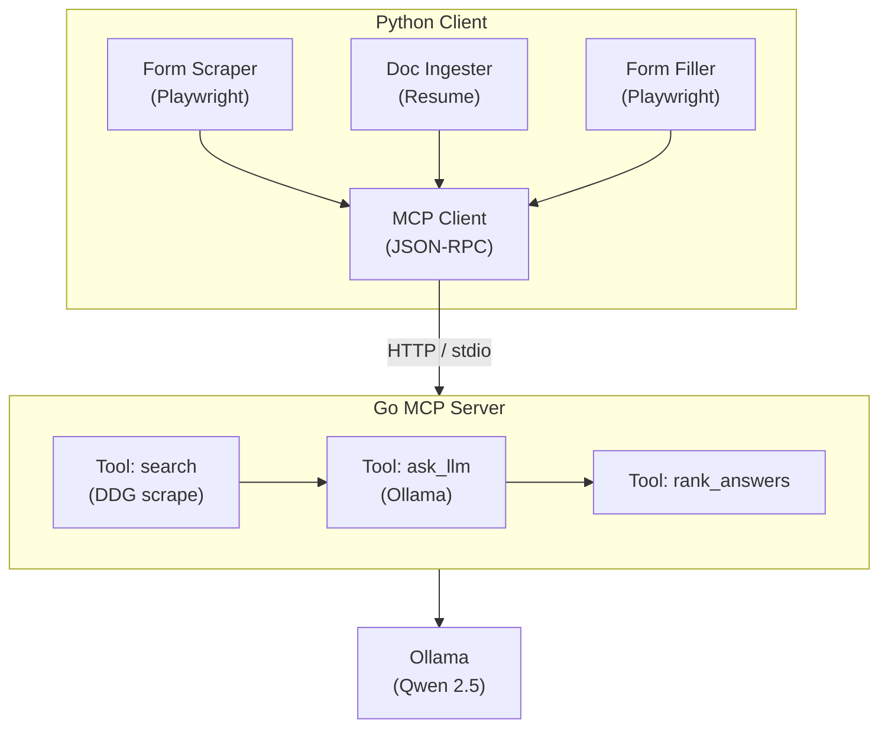

# Form Agent



### MCP (Go exposures)

Three tools over HTTP POST at `localhost:8080/mcp`:

```json
// Tool: ask_llm
{ "tool": "ask_llm", "params": { "question": "...", "context": "...", "options": ["a","b"] } }

// Tool: search
{ "tool": "search", "params": { "query": "...", "max_results": 3 } }

// Tool: rank_answers
{ "tool": "rank_answers", "params": { "question": "...", "candidate_a": "...", "candidate_b": "..." } }
```
