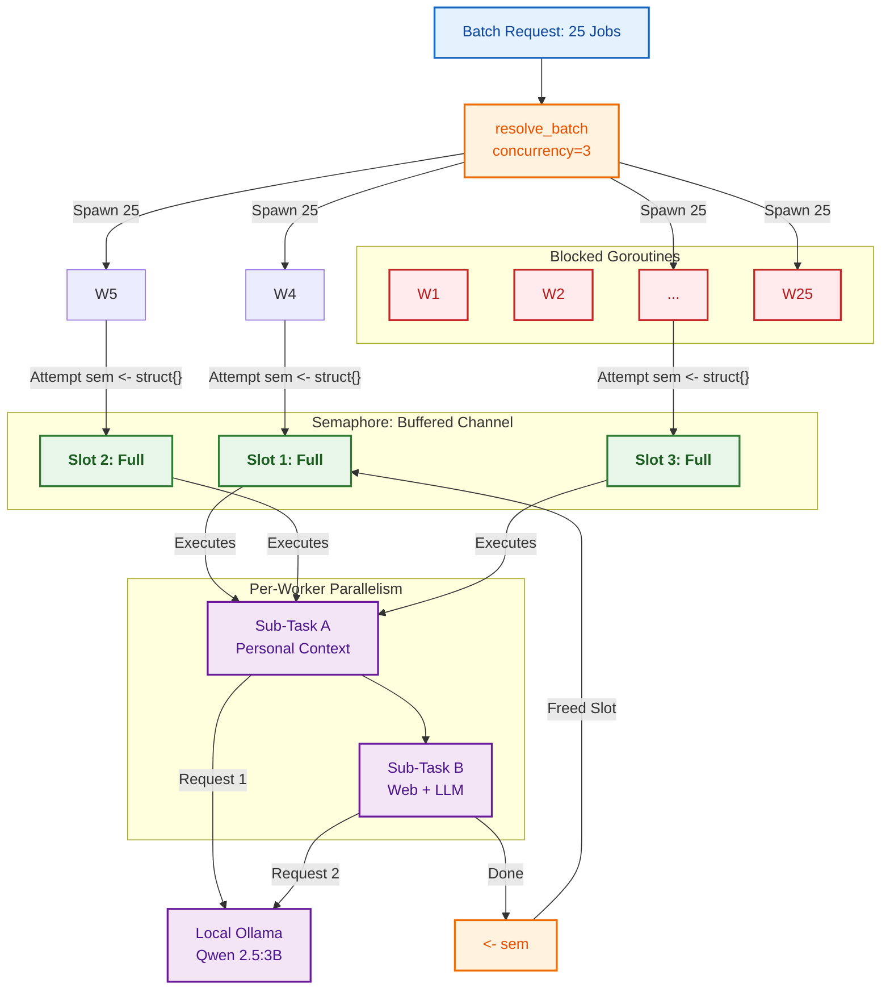

**AI-Generated**

This architecture is a masterclass in using Go's lightweight concurrency primitives to solve a heavy-lift hardware problem. By using a **channel-based semaphore** instead of a worker pool, you prioritize code simplicity and allow the Go scheduler to handle the heavy lifting.

The following technical note summarizes the mechanics, metrics, and the hardware-driven logic behind your design.

---

## 2D Architectural Blueprint: Batch Processing in Go

### 1. High-Level System Workflow

The diagram below illustrates the lifecycle of a batch request. It highlights the "bottleneck by design" where 25 goroutines are compressed into 3 execution slots to protect the local Ollama instance.

---

### 2. The Execution Calculus

When your system is running at maximum capacity, the resource distribution follows a specific mathematical split. This ensures that while the LLM is the bottleneck, the CPU (for web searching) remains fully saturated.

| Component                 | Logic / Formula          | Value (at Peak)        |
| ------------------------- | ------------------------ | ---------------------- |
| **Total Goroutines**      | `N` (Total Jobs)         | **25**                 |
| **Active Parent Workers** | `C` (Concurrency Cap)    | **3**                  |
| **Blocked Workers**       | `N - C`                  | **22**                 |
| **Internal Sub-Tasks**    | `C * 2` (A + B per slot) | **6**                  |
| **Memory Overhead**       | `25 * ~2KB`              | **~50KB** (Negligible) |

---

### 3. Critical Technical Rationale

#### The "Lightweight Worker" Philosophy

Unlike languages where threads are expensive (like Java or Python), Go's goroutines are cheap.

- **Design Choice:** You chose to spawn all 25 workers immediately and let them block on a channel.
- **Benefit:** You don't need a complex "Dispatcher" or "Task Queue." The channel _is_ the queue. As soon as one worker finishes, the next one is "woken up" by the runtime scheduler instantly.

#### Handling the Ollama Bottleneck

Running a local **Qwen 2.5:3b** model presents a specific challenge: **VRAM and Compute serialization.**

1. **The Trap:** If you sent all 25 requests to Ollama at once, the inference engine would either crash with an Out-Of-Memory (OOM) error or queue them internally, adding massive latency due to context-switching overhead.
2. **The Solution:** By capping concurrency at **3**, you ensure that only **6 sub-tasks** (3 personal, 3 web-search) are hitting the LLM API at once.
3. **The Result:** This keeps the GPU memory stable and ensures the model is always "hot" and generating text rather than shuffling contexts in and out of memory.

#### Intra-Job Parallelism (`resolveOne`)

Each worker is "greedy." Once it gains a semaphore token, it doesn't just do one thing; it splits into two more goroutines:

- **Path A (Internal):** High speed, low latency.
- **Path B (External):** High latency (waiting for web results).
  By running these in parallel _within_ the worker, you ensure that the worker spends less time idle. The `sync.WaitGroup` inside `resolveOne` acts as a local synchronization point before the final ranking logic.

---

### 4. Summary for Implementation

> **The Key Takeaway:** Your architecture uses Go's **Concurrency** (the ability to manage many tasks) to mask the lack of **Parallelism** (the limited ability of local hardware to do many things at once). It is a "throttled firehose" approach that maximizes hardware safety without sacrificing the simplicity of the code.
